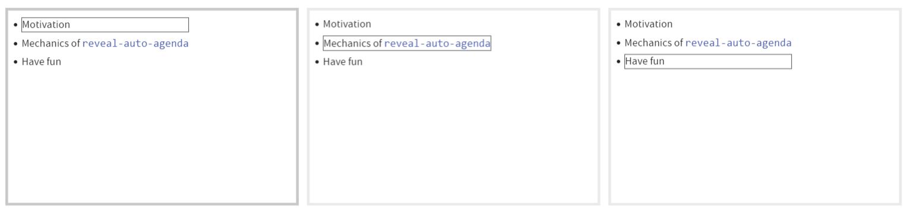

# reveal-auto-agenda

A quarto extension for `reveal.js` that automatically creates agenda slides from H1 heading titles.

## Installation

To install this extension in your current directory (or into the Quarto project that you're currently working in),  use the following command:

``` shell
quarto install extension andrie/reveal-auto-agenda
```

## Enabling

Add this to your document or project options:

``` yaml
filters:
  - reveal-auto-agenda
```

## Usage

Simply create your slides as normal, with H1 header slides marking transitions between agenda items.

This extension:

- Creates a list of the text of each H1 slide
- Insert this list into the body of each H1 slide
- Inserts CSS that marks the active section with a border box around the text

## Example



## Custom CSS

The extension will create custom CSS elements.  You can override these in your own CSS template:

``` css
.agenda {
}

.agenda-slide h1 {
  size: 0em;
  display: none;
}

.agenda-active {
  border: solid;
  margin-top: -0.5em;
  margin-bottom: -0.5em;
}
```


## Live preview

You can view a live preview of an example presentation at https://andrie.quarto.pub/reveal-auto-agenda/